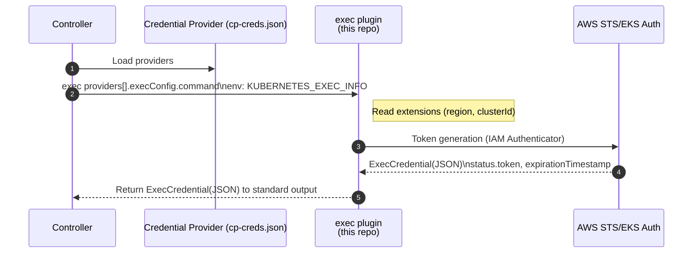

# EKS AWS Auth Plugin

A Credentials Provider plugin for ClusterProfile. It reads `region` and `clusterId` from the exec extensions (`KUBERNETES_EXEC_INFO` → `ExecCredential.Spec.Cluster.Config`), obtains a token, and returns **ExecCredential JSON** to standard output.

For common background and exec input/output specifications, please refer to the `README.md` at the repository root.

> For information on how to create controllers using Credential Plugins, please refer to the official `https://github.com/kubernetes-sigs/cluster-inventory-api/tree/main/pkg`. This README explains how to configure and operate the eks-aws-auth-plugin.

## Implementation Status

| Status |                    Feature                     |
| :----- | :--------------------------------------------- |
| ✅      | KEP-541 compliant                              |
| ✅      | Single binary / AWS CLI independent            |
| ✅      | Reads `region` and `clusterId` from extensions |

## Supported Scenarios

* **Use as a Credentials Provider plugin for ClusterProfile** (**primary use case**)

  * Obtains tokens using `region` and `clusterId` that are passed via exec extensions (`client.authentication.k8s.io/exec`)
  * Controller registers this plugin in `providers[].execConfig` (e.g., `cp-creds.json`)
* **Also usable as kubectl / kubeconfig exec plugin** (compatible)

  * Receives `KUBERNETES_EXEC_INFO` and returns ExecCredential JSON to standard output

## Build

Run `make build` at the repository root (output: `bin/eks-aws-auth-plugin`).

```bash
make build
```

## Usage

Used in the KEP-5339 style, where **the controller calls the Exec plugin**.

### 1) Provider Configuration (example: `cp-creds.json`)

```jsonc
{
  "providers": [
    {
      "name": "eks",
      "execConfig": {
        "apiVersion": "client.authentication.k8s.io/v1beta1",
        "command": "/path/to/bin/eks-aws-auth-plugin",
        "provideClusterInfo": true
      }
    }
  ]
}
```

### 2) Store cluster information in ClusterProfile

Provide `region` and `clusterId` via the exec extensions. The controller library copies the `extension` object into `ExecCredential.Spec.Cluster.Config` for the plugin.

```yaml
apiVersion: multicluster.x-k8s.io/v1alpha1
kind: ClusterProfile
metadata:
  name: my-cluster-1
spec:
  displayName: my-cluster-1
  clusterManager:
    name: EKS-Fleet
status:
  accessProviders:
  - name: eks
    cluster:
      # Optional, for kubeclient connectivity (not used by this plugin to mint tokens)
      server: https://xxx.gr7.ap-northeast-1.eks.amazonaws.com
      certificate-authority-data: <BASE64-PEM>
      extensions:
      - name: client.authentication.k8s.io/exec
        extension:
          region: ap-northeast-1
          clusterId: my-eks-cluster
```

## Required IAM Policies

This plugin uses the AWS IAM Authenticator token generator which relies on STS (`GetCallerIdentity`) under the hood. No explicit EKS permissions are required by this plugin.

If you prefer to provide an explicit (optional) policy example for clarity, you can use:

```json
{
  "Version": "2012-10-17",
  "Statement": [
    {
      "Sid": "AllowSTSGetCallerIdentity",
      "Effect": "Allow",
      "Action": [
        "sts:GetCallerIdentity"
      ],
      "Resource": "*"
    }
  ]
}
```

Note: Organizations SCPs or explicit Deny statements may still affect STS. Ensure your runtime environment can call `sts:GetCallerIdentity`.

## Architecture

### Overall Flow (Mermaid)



## Troubleshooting

* `missing ExecCredential.Spec.Cluster.Config (extensions)` → Ensure `client.authentication.k8s.io/exec` extension is present with `region` and `clusterId`
* `x509: certificate signed by unknown authority` → Verify the validity of `certificate-authority-data` (base64) in the kube cluster config (if used by your client)
* `KUBERNETES_EXEC_INFO is empty` → Check if `provideClusterInfo: true` is configured

<!-- Common KEP/exec explanations and links are consolidated in the root README -->
