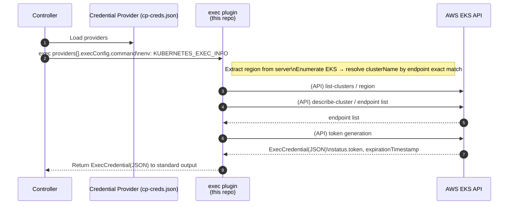

# EKS AWS Auth Plugin

A Credentials Provider plugin for ClusterProfile. It resolves the EKS cluster name from input (`KUBERNETES_EXEC_INFO` including `server/CA`), obtains a token, and returns **ExecCredential JSON** to standard output.

For common background and exec input/output specifications, please refer to the `README.md` at the repository root.

> For information on how to create controllers using Credential Plugins, please refer to the official `https://github.com/kubernetes-sigs/cluster-inventory-api/tree/main/pkg`. This README explains how to configure and operate the eks-aws-auth-plugin.

## Implementation Status

| Status | Feature                                     |
| :----- | :------------------------------------------ |
| ✅     | KEP-541 compliant |
| ✅     | Single binary / AWS CLI independent |
| ✅     | Region inference from endpoint       |
| ✅     | Automatic EKS cluster name resolution from Server      |
| ✅     | CA validation when `certificate-authority-data` is provided |

## Supported Scenarios

* **Use as a Credentials Provider plugin for ClusterProfile** (**primary use case**)

  * Obtains tokens using **server/CA** from `status.credentialProviders[].cluster` as input
  * When `certificate-authority-data` is provided, validates against EKS `describe-cluster.certificateAuthority.data`, and exits with error if no match
  * Controller registers this plugin in `providers[].execConfig` (e.g., `cp-creds.json`)
* **Also usable as kubectl / kubeconfig exec plugin** (compatible)

  * Receives `KUBERNETES_EXEC_INFO` and returns ExecCredential JSON to standard output


## Build

Run `make build` at the repository root (output: `bin/eks-aws-auth-plugin`).

```bash
make build
```

## Usage

Used in the KEP-5339 style, where **the controller calls the Exec plugin**.

### 1) Provider Configuration (example: `cp-creds.json`)

```jsonc
{
  "providers": [
    {
      "name": "eks",
      "execConfig": {
        "apiVersion": "client.authentication.k8s.io/v1beta1",
        "command": "/path/to/bin/eks-aws-auth-plugin",
        "provideClusterInfo": true
      }
    }
  ]
}
```

### 2) Store cluster information in ClusterProfile

Put **server/CA** in `status.credentialProviders[].cluster` (used by controller for resolution).

```yaml
apiVersion: multicluster.x-k8s.io/v1alpha1
kind: ClusterProfile
metadata:
  name: my-cluster-1
spec:
  displayName: my-cluster-1
  clusterManager:
    name: EKS-Fleet
status:
  credentialProviders:
    eks:
      cluster:
        server: https://xxx.gr7.ap-northeast-1.eks.amazonaws.com
        certificate-authority-data: <BASE64-PEM>
```

## Required IAM Policies

This plugin executes the following AWS APIs:

* EKS API
  * `eks:ListClusters`
  * `eks:DescribeCluster`
* STS API (uses `GetCallerIdentity` during token generation)
  * No explicit permission required.

An example minimal inline policy configuration is as follows (add region conditions or resource scope as needed):

```json
{
  "Version": "2012-10-17",
  "Statement": [
    {
      "Sid": "EksDiscover",
      "Effect": "Allow",
      "Action": [
        "eks:ListClusters",
        "eks:DescribeCluster"
      ],
      "Resource": "*"
    }
  ]
}
```

## Architecture

### Overall Flow (Mermaid)



## Troubleshooting

* `no matching EKS cluster` → Check ListClusters/DescribeCluster results, permissions, and AWS profile
* `x509: certificate signed by unknown authority` → Verify the validity of `certificate-authority-data` (base64)
* `KUBERNETES_EXEC_INFO is empty` → Check if `provideClusterInfo: true` is configured

<!-- Common KEP/exec explanations and links are consolidated in the root README -->
